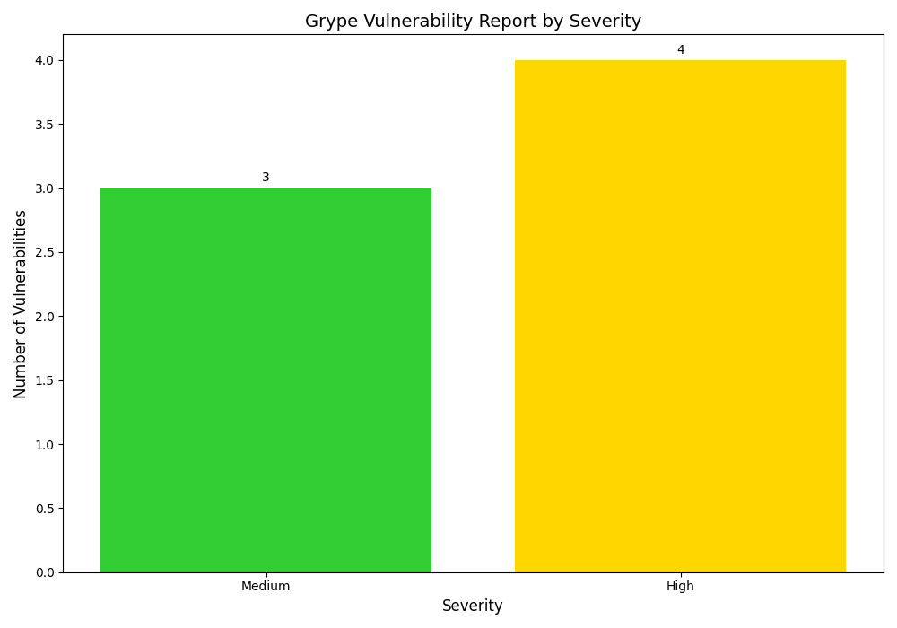

# 🧰 SBOM Vulnerability Scanner with Automated Graph Generation


This project automates **Software Bill of Materials (SBOM)** generation and **vulnerability scanning** using **Anchore’s Syft** and **Grype**, and then visualizes the results using **Python + Matplotlib**.

Every time you push new code to GitHub:
1. An SBOM is generated.
2. Vulnerabilities are scanned automatically.
3. A bar chart is created showing vulnerabilities by severity.
4. The latest chart is automatically updated here in the repository ✅

---

## 🛡️ **Latest Vulnerability Graph**

This chart is automatically updated with every new commit to the `main` branch:



---

## ⚙️ **How It Works**

### 🧩 Tools Used
| Tool | Purpose |
|------|----------|
| **Syft** | Generates SBOM (Software Bill of Materials) |
| **Grype** | Scans the SBOM or directory for vulnerabilities |
| **Python (Matplotlib)** | Creates a bar chart visualization |
| **GitHub Actions** | Automates the scanning and reporting process |

---

## 🔁 **Automation Workflow**

1. **Checkout the code** → The workflow retrieves your latest source code.
2. **Install Grype** → Downloads Anchore’s vulnerability scanner.
3. **Run Grype** → Scans the repo and outputs results in JSON.
4. **Run Python script** → `process_grype.py` reads JSON and generates a graph.
5. **Upload artifact** → Stores results as downloadable reports.
6. **Auto-commit graph** → Pushes updated `vulnerability_bar_chart.png` to the repo.

You can find the full automation steps inside:
.github/workflows/sbom-scan.yml
---

## 🧠 **Project Structure**
SBOM-Project/
│
├── process_grype.py # Python script for parsing and graph generation
├── requirements.txt # Python dependencies
├── sbom-scan.yml # GitHub Actions workflow (in .github/workflows/)
├── vulnerability_bar_chart.png # Auto-generated graph
├── grype-report.json # Vulnerability scan results (auto-generated)
└── README.md # Project documentation

---

## 🚀 **How to Run Locally**

If you want to run this project manually on your computer:

### 🧩 Prerequisites
- Python 3.10+
- Syft
- Grype
- Matplotlib

### ⚙️ Installation Steps
```bash
# Clone this repository
git clone https://github.com/madhavi-valavoju/SBOM-Project.git
cd SBOM-Project

# Create and activate a virtual environment (optional but recommended)
python -m venv venv
.\venv\Scripts\activate   # for Windows

# Install dependencies
pip install -r requirements.txt
# Generate SBOM (optional)
syft dir:. -o json > sbom.json

# Scan with Grype
grype dir:. -o json > grype-report.json

### 📊 Generate Graph


python process_grype.py grype-report.json

The file vulnerability_bar_chart.png will be generated in your project folder.

### 🌐 GitHub Actions Automation

Every time code is pushed to the main branch:

The workflow runs the Grype scanner.

Generates a graph of vulnerabilities.

Pushes the updated image automatically.

Makes it visible right here in your README.

###🧩 Tech Stack

Languages: Python, YAML

Tools: Syft, Grype, Matplotlib

Automation: GitHub Actions

Platform: Ubuntu (runner environment)

### 🎯 Key Features

✅ Automatically scans your project for vulnerabilities
✅ Generates clear visual vulnerability reports
✅ Automatically updates the chart in your GitHub repo
✅ Fully integrated with CI/CD pipeline
